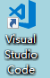
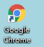
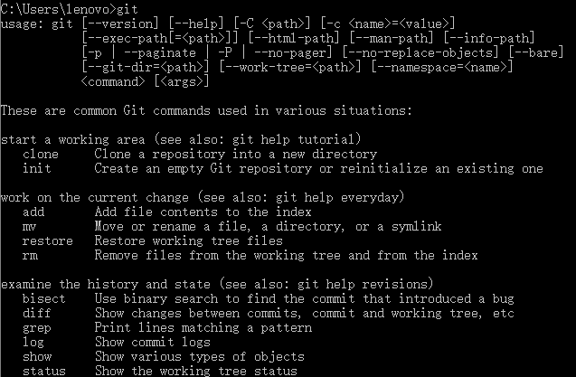
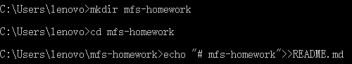
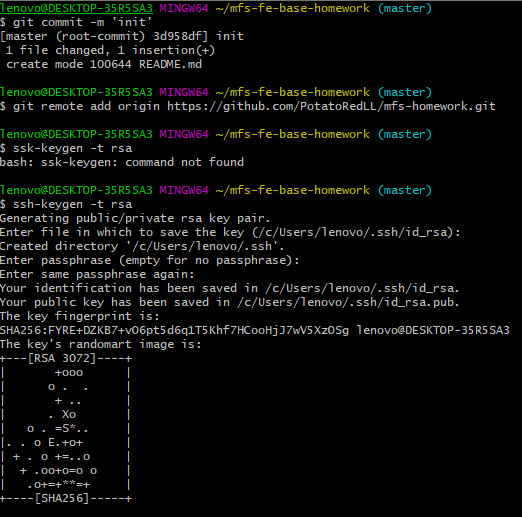
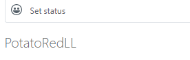
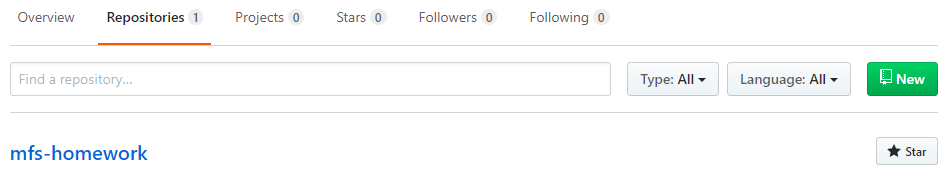
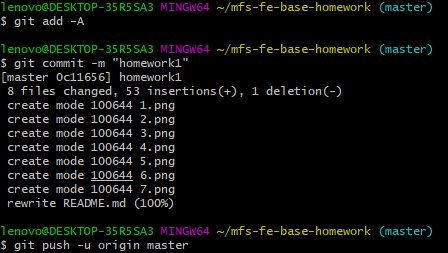

# 李琳的作业库
> 码蜂社 前端基础班 作业答题库
**码蜂社和李琳版权所有，转载请注明出处**

## **问答题**
1. 互联网产品是如何从无到有的？   
产品经理（PM/PD）有所需求，将需求告诉视觉/交互设计（UE）,前端开发人员（PE），后端开发人员（RD）。视觉/交互设计人员负责提供设计稿，并与产品经理讨论交流至通过，最后以图片的形式提供给前端开发人员。前端开发人员以此为基础进行开发，一定情况下前端开发人员可能无法实现原定设计，将反馈给视觉/交互设计人员稍作修改。后端开发人员了解需求后开始设计数据库、软件架构等，前后端开发人员需要反复交互，后端为前端支撑，前端与后端相整合，以得到较为完整的产品，以上人员基本可以完成初期对软件的开发。接下来，测试人员（QA）对软件在各种情况下进行反复测试，寻找bug，直至测试满意，此时软件基本达到可以上线程度。交付给运维人员（OP），由运维人员将产品上线，带给用户。
2. 什么是前端？   
前端是直接和用户打交道，用户可以直接看到的部分。前端的起点，网景公司推出navigation，以便于科学家阅读文档，基于HTML，全静态。之后随着人们对美观需求的上升，也就有了加入flash元素，CSS、JavaScript的出现。随HTML5和CSS3的到来，结合js使用，已经可以创造十分丰富的交互效果。总言之，前端随着需求发展，从只对内容需求到如今的美观丰富，越来越注重用户体验。
3. 前端的基础，进阶，高级各需要掌握哪些技术？   
   * 基础：HTML（结构框架），CSS（表现），JavaScript（行为）   
      * HTML：超文本标签语言，网页元素的排列
      * CSS：层叠样式表，定义网页样式
      * JavaScript：轻量级网页脚本语言，联系前端后端，可实现复杂动画     
   * 进阶：
      * jQuery、bootstrap框架
      * HTTP协议
      * 通过JSON获取数据
      * 正则表达式
      * 服务器脚本语言（Node.js，PHP，ASP，JSP）
   * 高级：学无止境
      * 页面性能优化，SEO站内优化
      * 模块化：AMD，CMD
      * 框架化：
           * underscore、jQuery、bootstrap
           * MVC backbone，MVVM backbone、Vue.js、angular、react
           * Web components、redux
      * 自动化：
           * coffee script、typescript
           * sass、stylus、less
           * 模板引擎
           * Grunt、Gulp、webpack……
## **工具安装**
### **编辑器安装**
如图所示，已安装VScode    
        
### **使用 chrome**
如图所示，已安装chrome    
  
### **使用 Git**
如图所示，已安装 Git   
   
命令行创建本体仓库   
   

## **实践题**
### **学会使用 Markdown 编写文档**
如本文档所示
### **Git 的基本使用 和 Github 注册账号**
账号注册及创建一个名为mfs-homework的仓库   
  
   
最后，提交文件   
  
